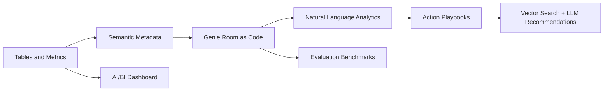
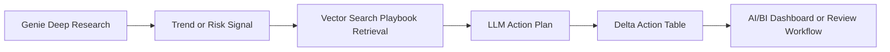

# Databricks Genie Deployment Kit

[](https://www.databricks.com/)
[](#what-this-repo-does)
[](https://dbc-5a674036-8eaa.cloud.databricks.com/dashboardsv3/01f173eb9b821ef9b5cf8e6c8ec78028/published?o=7474648785966975)
[](#production-playbooks)

A deployment-as-code framework for building, testing, documenting, publishing, and operating Databricks Genie spaces.

This repository treats a Genie room like a real analytics product. The room definition, semantic metadata, example SQL, benchmark questions, dashboard brief, deployment scripts, and action playbooks all live in version-controlled files that can be reviewed, tested, reused, and redeployed.

## Portfolio Demo

The public showcase is the Olist E-Commerce demo:

| Asset | Link |
|---|---|
| Live AI/BI dashboard | [Open the published dashboard](https://dbc-5a674036-8eaa.cloud.databricks.com/dashboardsv3/01f173eb9b821ef9b5cf8e6c8ec78028/published?o=7474648785966975) |
| Demo package | [examples/olist_ecommerce](examples/olist_ecommerce) |
| Dashboard documentation | [examples/olist_ecommerce/dashboard/PUBLISHED_DASHBOARD.md](examples/olist_ecommerce/dashboard/PUBLISHED_DASHBOARD.md) |
| Generated action playbook | [examples/olist_ecommerce/pipeline_playbook_generator/generated/olist_ecommerce_analytics_action_playbook.md](examples/olist_ecommerce/pipeline_playbook_generator/generated/olist_ecommerce_analytics_action_playbook.md) |
| Pipeline config | [examples/olist_ecommerce/pipeline/pipeline_config.yml](examples/olist_ecommerce/pipeline/pipeline_config.yml) |
| Production playbook pattern | [examples/olist_ecommerce/pipeline/PRODUCTION_PLAYBOOK.md](examples/olist_ecommerce/pipeline/PRODUCTION_PLAYBOOK.md) |

The demo uses the public Olist Brazilian E-Commerce dataset and shows an end-to-end Databricks AI/BI workflow:

- raw CSV ingestion into Unity Catalog
- bronze table creation from public data
- enriched gold order metrics
- diagnostic tables for Pareto, driver-impact, and target-gap analysis
- Genie room deployment from local files
- published AI/BI dashboard with 29 interactive widgets across 8 pages
- generated playbook assets for retrieval-augmented action planning
- benchmark questions and SQL examples for quality checks

## Why This Exists

Genie rooms are powerful, but they can become hard to operate when the important logic only lives in the UI. Metric definitions, prompt guidance, SQL examples, table descriptions, evaluation questions, and stakeholder notes deserve the same discipline as application code.

This kit creates that operating model:



## What This Repo Does

| Capability | What it enables |
|---|---|
| Room configuration | Define Genie room title, description, data sources, and user-facing instructions in files |
| Semantic metadata | Document columns, measures, dimensions, entity matching, and value dictionaries |
| SQL examples | Teach Genie reliable query patterns for business-critical questions |
| Snippet library | Reuse canonical measures, filters, and joins across instructions |
| Benchmarks | Test whether the room answers important questions consistently |
| Deployment scripts | Push a room package from Git to Databricks instead of hand-editing everything in the UI |
| Dashboard handoff | Move from a working Genie-ready model to an AI/BI dashboard quickly |
| Playbook generator | Convert room metadata and diagnostic logic into RAG-ready action playbooks |
| Action-plan pipeline | Use Genie trends, Vector Search context, and LLM endpoints to produce prioritized recommendations |

## Dashboard Workflow

One of the strongest patterns in this project is that a dashboard does not have to start from a blank page.

Once a Genie room has a reliable semantic model, example questions, diagnostic fields, and validated tables, the same assets can guide dashboard creation:

1. Use the Genie room to identify the business questions people actually ask.
2. Promote stable question patterns into dashboard pages and widgets.
3. Use the gold and diagnostic tables as dashboard-ready sources.
4. Keep metric definitions aligned across Genie, SQL examples, and dashboard visuals.
5. Publish the dashboard with run-as-owner sharing for external demos or stakeholder reviews.

In the Olist demo, this produced a published dashboard with 29 widgets across 8 pages from the same tables used by the Genie room.

## Production Playbooks

The playbook layer is the bridge between "what happened?" and "what should we do next?"

The generator can turn a room package into structured playbook assets:

- a human-readable markdown playbook
- a PDF suitable for upload to a Unity Catalog Volume
- chunk JSON for Vector Search indexing
- scenario-specific recommendations tied to metrics and diagnostic fields

In production, this pattern can support:

- operational review assistants
- incident response for metric regressions
- weekly business review action planning
- customer-experience improvement workflows
- retrieval-augmented explanations inside internal analytics tools

The intended production loop is:



The playbook should be SME-reviewed before production use, but the repo demonstrates how the assets can be generated, versioned, indexed, and reused.

## Olist Demo Model

The deployed demo uses three gold/diagnostic tables:

- `workspace.olist_ecommerce.olist_order_metrics_mv`
- `workspace.olist_ecommerce.olist_category_diagnostics_mv`
- `workspace.olist_ecommerce.olist_customer_state_diagnostics_mv`

Example Genie questions:

- What was total order value by month?
- Which product categories have the highest late delivery rate?
- Which product categories make up the top 80 percent of order value?
- How does late delivery affect review score by product category?
- To reach a 4.2 average review score, which categories need the largest late delivery rate reduction?

## Repository Tour

| Path | Purpose |
|---|---|
| `room.config.yml` | Generic room manifest template |
| `data_sources/` | Table registrations |
| `metadata/columns/` | Per-column semantic configuration |
| `instructions/` | Active Genie instructions, example SQL, and snippets |
| `instruction_library/` | Larger instruction corpus plus activation manifests |
| `benchmarks/` | Ground-truth questions for room evaluation |
| `scripts/` | Validation, materialization, push/pull, benchmark tooling |
| `docs/` | Authoring workflows, evaluation workflows, and policy docs |
| `geniecode/` | Agent knowledge sidecar for maintaining a room |
| `pipeline/` | Optional action-plan pipeline for trend analysis and recommendations |
| `pipeline_playbook_generator/` | Generates RAG-ready action playbooks |
| `reports/` | UAT and stakeholder reporting scaffolds |
| `examples/` | Worked examples, including the Olist public dataset demo |
| `skills/` | Task runbooks for repeatable operations |

## Quick Start

Validate the generic kit:

```bash
python scripts/validate.py
```

Materialize active instruction-library assets:

```bash
python scripts/materialize.py
```

Deploy a configured room:

```bash
python scripts/push_folder_to_room.py --env local
```

For the Olist demo, use the dedicated deployment guide:

[examples/olist_ecommerce/DEPLOY.md](examples/olist_ecommerce/DEPLOY.md)

## Olist Demo Assets

- [Dataset notes](examples/olist_ecommerce/DATASET.md)
- [Databricks setup status](examples/olist_ecommerce/SETUP_STATUS.md)
- [Enrichment layer docs](examples/olist_ecommerce/ENRICHMENT.md)
- [Genie room deploy script](examples/olist_ecommerce/deploy_genie_room.py)
- [AI/BI dashboard brief](examples/olist_ecommerce/dashboard/dashboard_brief.md)
- [Published dashboard details](examples/olist_ecommerce/dashboard/PUBLISHED_DASHBOARD.md)
- [Starter dashboard SQL](examples/olist_ecommerce/dashboard/starter_queries.sql)
- [Action-plan pipeline example](examples/olist_ecommerce/pipeline/README.md)
- [Production playbook pattern](examples/olist_ecommerce/pipeline/PRODUCTION_PLAYBOOK.md)
- [Generated Olist action playbook](examples/olist_ecommerce/pipeline_playbook_generator/generated/olist_ecommerce_analytics_action_playbook.md)
- Databricks notebook-style scripts in `examples/olist_ecommerce/databricks/`

## Public Dataset Attribution

The Olist demo is based on the Brazilian E-Commerce Public Dataset by Olist:

https://www.kaggle.com/datasets/olistbr/brazilian-ecommerce

Check the Kaggle dataset page for the current license and attribution requirements before publishing screenshots, derived extracts, or packaged sample files.

## Security Notes

- Do not commit Databricks tokens.
- Do not commit downloaded raw datasets.
- Keep workspace-specific values in ignored local environment files.
- Use placeholders in public examples where possible.
- Rotate any token that was pasted into chat, shell history, or screenshots.

## For AI Coding Agents

Read [AGENTS.md](AGENTS.md) first. It contains the full operating manual, file contracts, Genie API notes, and task runbooks.
