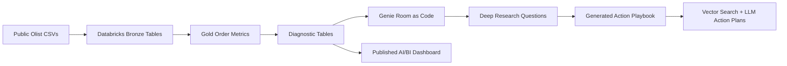

# Olist E-Commerce Genie Demo

Databricks AI/BI and Genie demo built on the public Brazilian E-Commerce dataset by Olist.

Live dashboard:

[Olist E-Commerce AI/BI Dashboard](https://dbc-5a674036-8eaa.cloud.databricks.com/dashboardsv3/01f173eb9b821ef9b5cf8e6c8ec78028/published?o=7474648785966975)

## Dataset

Source: https://www.kaggle.com/datasets/olistbr/brazilian-ecommerce

The dataset contains roughly 100k marketplace orders from 2016-2018 across customers, orders, order items, payments, reviews, products, sellers, product category translations, and geolocation. Check the Kaggle dataset page for current license and attribution terms before publishing derived assets.

## Demo Goal

Create a public portfolio project that shows:

- raw CSV ingestion into Databricks
- bronze/silver/gold transformation flow
- a Genie-ready gold table
- semantic metadata and sample questions
- AI/BI dashboard planning
- a published 29-widget AI/BI dashboard across 8 pages
- generated action playbooks for RAG-backed action planning
- benchmark questions for deployment quality

## End-to-End Demo Flow



## Target Gold Table

`workspace.olist_ecommerce.olist_order_metrics_mv`

Grain: one row per order.

This gold table is intentionally broad enough for natural-language analytics:

- order status and purchase date
- customer state/city
- seller state/city
- product category
- order value, freight, and payment value
- item count and seller count
- review score
- delivery days and late-delivery flag

## Databricks Setup

1. Download the Olist CSV files from Kaggle.
2. Upload them to a Unity Catalog volume, for example:

```text
/Volumes/workspace/olist_ecommerce/olist_raw/
```

3. Copy or import the notebooks in `databricks/`.
4. Edit the widget defaults or pass parameters:

```text
catalog=workspace
schema=olist_ecommerce
raw_volume=/Volumes/workspace/olist_ecommerce/olist_raw
```

5. Run:

```text
01_ingest_bronze.py
02_build_gold_order_metrics.py
```

6. Update this example's `data_sources/tables.yml` and `metadata/columns/olist_order_metrics_mv.yml` with your actual catalog and schema.

## Genie Room

Use this room for questions like:

- What was total order value by month?
- Which product categories have the highest late delivery rate?
- Which states have the lowest average review score?
- Are late deliveries associated with lower review scores?
- Which seller states drive the most freight cost?

## AI/BI Dashboard

The dashboard is already published and shareable:

[Open the live dashboard](https://dbc-5a674036-8eaa.cloud.databricks.com/dashboardsv3/01f173eb9b821ef9b5cf8e6c8ec78028/published?o=7474648785966975)

It contains 29 interactive widgets across 8 pages, using run-as-owner sharing for external demo viewers.

Use `dashboard/dashboard_brief.md` and `dashboard/PUBLISHED_DASHBOARD.md` for the dashboard story. The layout covers:

- Executive overview
- Revenue and order trends
- Delivery performance
- Review quality
- Geography and product category drilldowns
- Pareto, driver-impact, and 4.2 review target-gap diagnostics

## Action-Plan Pipeline

Use `pipeline/README.md` for the Olist adaptation of the generic action-plan pipeline. It connects Genie Deep Research, a generated Olist playbook, Vector Search retrieval, and LLM-generated action plans that can be written back to Delta tables.

Generated playbook assets live in `pipeline_playbook_generator/generated/`:

- markdown playbook
- Vector Search chunk JSON
- PDF source file for indexing
- generation summary

The playbook is intentionally tied to the dashboard diagnostics: when a category or state shows high order value, high lateness, review-score weakness, or an unreachable 4.2 target through delivery fixes alone, the playbook explains how to turn that signal into a concrete action plan.
