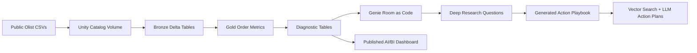

# Olist E-Commerce Genie and AI/BI Demo

A public Databricks AI/BI portfolio demo built on the Brazilian E-Commerce dataset by Olist.

| Demo Asset | Link |
|---|---|
| Published dashboard | [Open the live AI/BI dashboard](https://dbc-5a674036-8eaa.cloud.databricks.com/dashboardsv3/01f173eb9b821ef9b5cf8e6c8ec78028/published?o=7474648785966975) |
| Dashboard details | [dashboard/PUBLISHED_DASHBOARD.md](dashboard/PUBLISHED_DASHBOARD.md) |
| Deployment guide | [DEPLOY.md](DEPLOY.md) |
| Enrichment notes | [ENRICHMENT.md](ENRICHMENT.md) |
| Generated playbook | [pipeline_playbook_generator/generated/olist_ecommerce_analytics_action_playbook.md](pipeline_playbook_generator/generated/olist_ecommerce_analytics_action_playbook.md) |
| Pipeline config | [pipeline/pipeline_config.yml](pipeline/pipeline_config.yml) |

## What This Demo Shows

This example turns a public CSV dataset into a complete Databricks analytics product:

- raw Olist files loaded to a Unity Catalog Volume
- bronze Delta tables for every source file
- a Genie-ready gold order metrics table
- diagnostic tables for Pareto, driver-impact, and target-gap analysis
- semantic metadata and sample SQL stored in Git
- a deployed Genie room created from local files
- a published AI/BI dashboard with 29 widgets across 8 pages
- generated action playbook assets for Vector Search and LLM-backed recommendations

## End-to-End Flow



## Dataset

Source: https://www.kaggle.com/datasets/olistbr/brazilian-ecommerce

The dataset contains roughly 100k marketplace orders from 2016-2018 across customers, orders, order items, payments, reviews, products, sellers, product category translations, and geolocation. Check the Kaggle dataset page for current license and attribution terms before publishing derived assets.

## Data Model

Primary table:

`workspace.olist_ecommerce.olist_order_metrics_mv`

Grain: one row per order.

The gold table supports natural-language analytics and dashboarding across:

- order status and purchase date
- customer geography
- seller geography
- product category
- order value, freight value, and payment value
- item count and seller count
- review score
- delivery days and late-delivery status
- diagnostic buckets for review, order value, delivery speed, and delivery quality

Diagnostic tables:

- `workspace.olist_ecommerce.olist_category_diagnostics_mv`
- `workspace.olist_ecommerce.olist_customer_state_diagnostics_mv`

These tables power Pareto analysis, review-score impact analysis, and target-gap questions such as how much late delivery would need to improve to reach a 4.2 average review score.

## Genie Room

The Genie room package includes:

- table registration in `data_sources/tables.yml`
- column-level semantic metadata in `metadata/columns/`
- general instructions in `instructions/general.md`
- example SQL question patterns in `instructions/example_sql/`
- reusable measure and filter snippets in `instructions/sql_snippets/`
- benchmark questions in `benchmarks/`
- a deployment script in `deploy_genie_room.py`

Useful Genie questions:

- What was total order value by month?
- Which product categories have the highest late delivery rate?
- Which states have the lowest average review score?
- Which product categories make up the top 80 percent of order value?
- How does late delivery affect review score by product category?
- To reach a 4.2 average review score, which categories need the largest late delivery rate reduction?

## Published AI/BI Dashboard

[Open the live dashboard](https://dbc-5a674036-8eaa.cloud.databricks.com/dashboardsv3/01f173eb9b821ef9b5cf8e6c8ec78028/published?o=7474648785966975)

The dashboard is published with run-as-owner sharing for external demo viewers. It contains:

- 29 interactive widgets
- 8 dashboard pages
- executive KPIs
- order value and order volume trends
- delivery reliability views
- customer review quality views
- product category and geography drilldowns
- Pareto and target-gap diagnostics

The important design point: the dashboard was not treated as a separate artifact. It was created from the same trusted tables, metrics, and business questions used by Genie. That makes it easy to move from a working Genie room into a polished AI/BI dashboard because the semantic work is already done.

## Action-Plan Pipeline and Playbook

This example also adapts the generic action-plan pipeline:

[pipeline/README.md](pipeline/README.md)

The generated playbook assets live in:

[pipeline_playbook_generator/generated](pipeline_playbook_generator/generated)

The pattern is production-oriented:

1. Genie Deep Research identifies a trend, warning pattern, or diagnostic signal.
2. A generated playbook is chunked and indexed with Databricks Vector Search.
3. Retrieved playbook context is passed to an LLM endpoint.
4. The LLM produces a prioritized action plan.
5. The action plan can be written back to Delta tables for dashboards, review queues, or operational workflows.

The playbook covers:

- high-value categories with elevated late delivery
- late delivery impact on review score
- 4.2 review-score target gaps
- customer-state Pareto concentration
- when delivery fixes are enough and when non-delivery customer-experience work is also needed

In production, this layer can support weekly business reviews, CX improvement programs, metric regression triage, operational incident follow-up, or analyst copilot workflows. The generated content should be reviewed by subject-matter experts before use in a live decision process.

## Databricks Setup

1. Download the Olist CSV files from Kaggle.
2. Upload them to a Unity Catalog volume, for example:

```text
/Volumes/workspace/olist_ecommerce/olist_raw/
```

3. Copy or import the notebooks in `databricks/`.
4. Edit the widget defaults or pass parameters:

```text
catalog=workspace
schema=olist_ecommerce
raw_volume=/Volumes/workspace/olist_ecommerce/olist_raw
```

5. Run:

```text
01_ingest_bronze.py
02_build_gold_order_metrics.py
```

6. Deploy or update the Genie room with:

```bash
python examples/olist_ecommerce/deploy_genie_room.py
```
