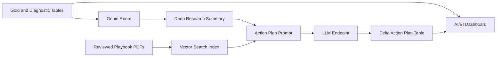

# Production Playbook Pattern

The Olist playbook is a demo artifact, but the pattern is designed for production analytics operations.

## What The Playbook Adds

Dashboards and Genie answer analytical questions. A playbook helps convert the answer into an operating response.

For example:

- dashboard signal: a high-value product category has elevated late delivery
- Genie question: how does late delivery affect review score for that category?
- playbook retrieval: find the relevant response pattern for late delivery and review impact
- LLM output: generate immediate actions, short-term actions, and measurement targets
- production table: store the action plan for review, tracking, or dashboard display

## Production Architecture

## Recommended Production Controls

- Treat playbooks as reviewed business content, not ad hoc prompt text.
- Store playbook source files in Git and generated PDFs in a governed Unity Catalog Volume.
- Index playbook chunks with metadata such as domain, scenario, metric, owner, and review date.
- Require SME review for generated recommendations before they become operational tasks.
- Log every generated action plan with source question, retrieved chunks, model endpoint, timestamp, and reviewer status.
- Add evaluation questions for action quality, not only SQL correctness.
- Keep dashboard, Genie room, and playbook metrics aligned to the same gold tables.

## Example Production Uses

| Use case | How the playbook helps |
|---|---|
| Weekly business review | Converts metric movement into structured next steps |
| Customer experience triage | Separates delivery-driven review issues from non-delivery CX issues |
| Operational incident follow-up | Creates a repeatable response format for priority categories or regions |
| Analyst copilot | Gives analysts grounded recommendations tied to approved business logic |
| Dashboard action layer | Adds "recommended next action" tables beside KPI views |

## Olist Demo Scenarios

The generated Olist playbook includes response patterns for:

- high-value categories with elevated late delivery
- late delivery strongly affecting review score
- categories with a modeled path to a 4.2 average review score
- cases where late delivery fixes alone cannot reach the review target
- customer-state Pareto concentration

The generated playbook is available here:

[../pipeline_playbook_generator/generated/olist_ecommerce_analytics_action_playbook.md](../pipeline_playbook_generator/generated/olist_ecommerce_analytics_action_playbook.md)
